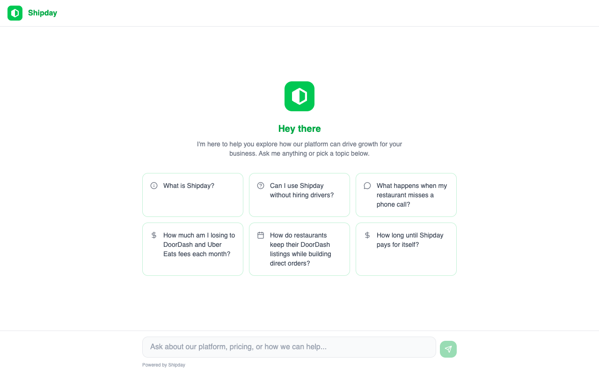
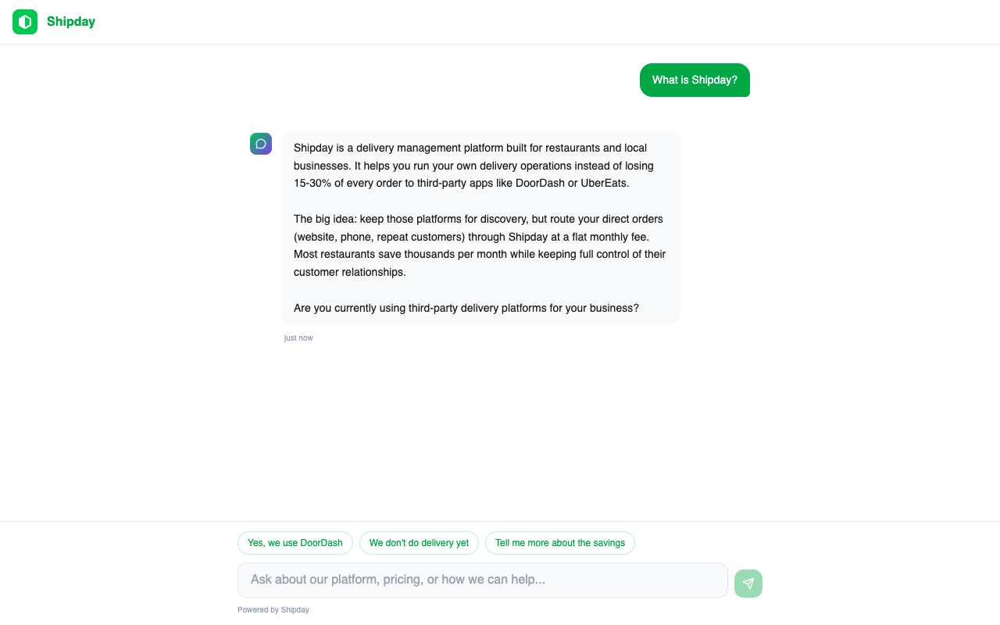
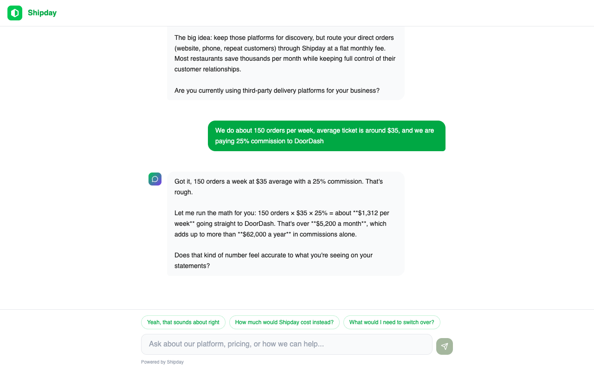
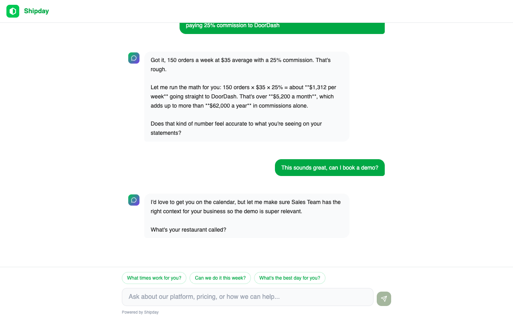
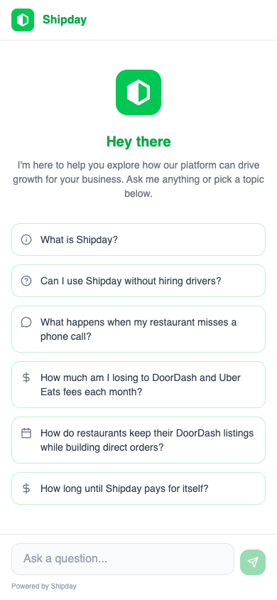
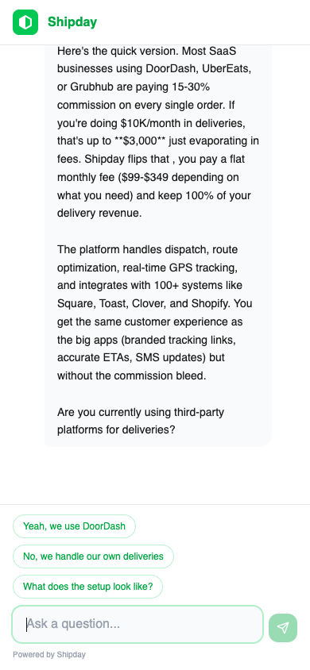
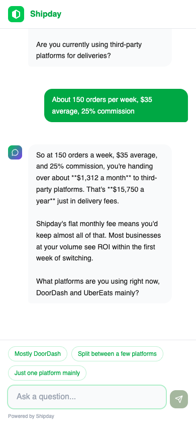

# Screenshots

All screenshots use demo data only. No real prospect names, emails, business names, or revenue figures.

## Gallery

### 1. Welcome Screen

Initial chat view with Shipday branding, greeting, and 6 starter prompt chips. No conversation data visible.

### 2. Discovery Conversation

Agent running discovery questions after a starter prompt click. Uses demo data (150 orders/week, $35 average ticket, 25% commission).

### 3. ROI Computation

Inline SVG chart showing computed annual savings based on the demo qualification data.

### 4. Demo Booking

Agent presenting available time slots via tool calling. Calendar availability is real-time from Google Calendar.

---

## Mobile Views (390px)

### 5. Welcome Screen (Mobile)

Full starter prompt list stacks into single column on mobile. 44px minimum touch targets maintained.

### 6. Discovery Conversation (Mobile)

Discovery flow on mobile viewport. Message bubbles and quick-reply chips adapt to narrow width.

### 7. ROI Computation (Mobile)

ROI breakdown and follow-up questions on mobile. Platform selection chips stack vertically.
